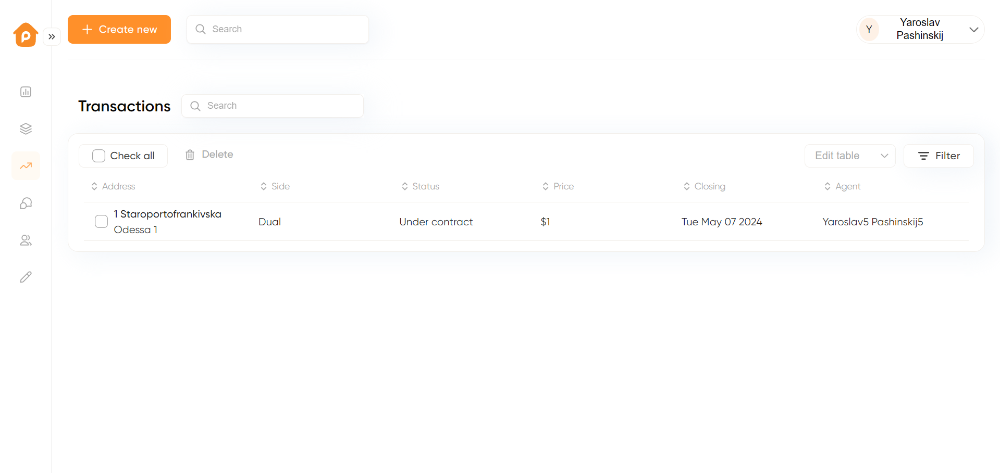

# Pentillo: sample Nest.js project

## Description

SaaS Website for real estate transactions management, including members invitations, creation of templates and transactions, members' permissions and task management. The scope of works includes basic functionality including auth, OAuth, Stripe Subscriptions, Role based access control, workspace maagement, roles management within workspace, invitations,email sending, templates creation for transaction, Transactions creation from scratch and from Template, direct email functinonality with Google and Outlook APIs

## Technology Stack

 - Nest.js - enterprise-level Node.js framework
 - Prisma - Next-generation Node.js and TypeScript ORM 
 - Sendgrid - service for email sending
 - Stripe - payment service
 - AWS S3 - file storage